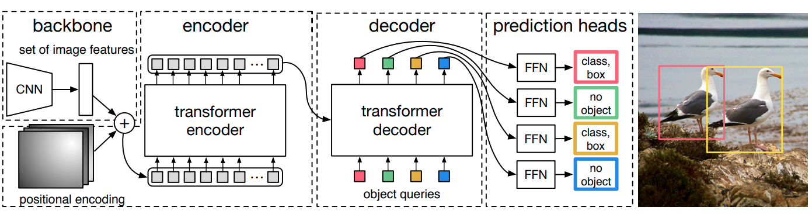

# DETR Tensorflow

[DETR : End-to-End Object Detection with Transformers](https://arxiv.org/pdf/2005.12872.pdf):将`Transformer`应用于目标检测。Pytorch版本的实现：[facebookresearch/detr](https://github.com/facebookresearch/detr)。本仓库基于Tensorflow实现DETR，包括训练代码、推理代码以及`finetune`代码。主要参考：[
detr-tensorflow](https://github.com/Visual-Behavior/detr-tensorflow)。DETR网络结构图如下所示：



## 项目架构
```
├─data：数据集基本操作
├─detr：DETR网络实现
│  ├─loss：损失函数
│  └─networks：主要网络实现代码
├─logger：日志脚本
├─notebooks：介绍说明的Jupyter notebook
└─src：一些资源文件，如readme的图像
```

## 介绍说明

- ✍ [DETR Tensorflow - How to load a dataset.ipynb](https://github.com/RyanCCC/DETR/blob/main/notebooks/How%20to%20load%20a%20dataset.ipynb)
- ✍ [DETR Tensorflow - Finetuning tutorial.ipynb](https://github.com/RyanCCC/DETR/blob/main/notebooks/DETR%20Tensorflow%20-%20%20Finetuning%20tutorial.ipynb)
- ✍ [DETR Tensorflow - How to setup a custom dataset.ipynb](https://github.com/RyanCCC/DETR/blob/main/notebooks/DETR%20Tensorflow%20-%20%20How%20to%20setup%20a%20custom%20dataset.ipynb)
- 🚀 [Finetuning DETR on Tensorflow - A step by step guide](https://wandb.ai/thibault-neveu/detr-tensorflow-log/reports/Finetuning-DETR-on-Tensorflow-A-step-by-step-tutorial--VmlldzozOTYyNzQ)


## 模型训练

训练coco数据集，数据文件架构如下：

- data_dir：coco数据集根目录
- img_dir：训练集和验证集图像文件夹
- ann_file：训练集和验证集图像标注文件夹

执行命令：```python train_coco.py --data_dir /path/to/COCO --batch_size 8  --target_batch 32 --log```。

## 模型微调

微调的基本流程：
```python
# Load the pretrained model
detr = get_detr_model(config, include_top=False, nb_class=3, weights="detr", num_decoder_layers=6, num_encoder_layers=6)
detr.summary()

# Load your dataset
train_dt, class_names = load_tfcsv_dataset(config, config.batch_size, augmentation=True)

# Setup the optimziers and the trainable variables
optimzers = setup_optimizers(detr, config)

# Train the model
training.fit(detr, train_dt, optimzers, config, epoch_nb, class_names)
```

### Pacal VOC数据集

目录结构如下：

- data_dir：数据集根目录
- img_dir：数据集的图像
- ann_file：数据集标注文件

执行命令：```python finetune_voc.py --data_dir /home/thibault/data/VOCdevkit/VOC2012 --img_dir JPEGImages --ann_dir Annotations --batch_size 8 --target_batch 32  --log```

### hardhatcsv数据集

目录结构如下：

- data_dir：数据集根目录
- img_dir：数据集的图像
- ann_file：数据集标注文件

执行命令：```python  finetune_hardhat.py --data_dir /home/thibault/data/hardhat --batch_size 8 --target_batch 32 --log```

## 模型评估

测试集数据目录结构如下：

- data_dir：测试集根目录
- img_dir：测试集的图像
- ann_file：测试集Ground True

执行命令:```python eval.py --data_dir /path/to/coco/dataset --img_dir val2017 --ann_file annotations/instances_val2017.json```

